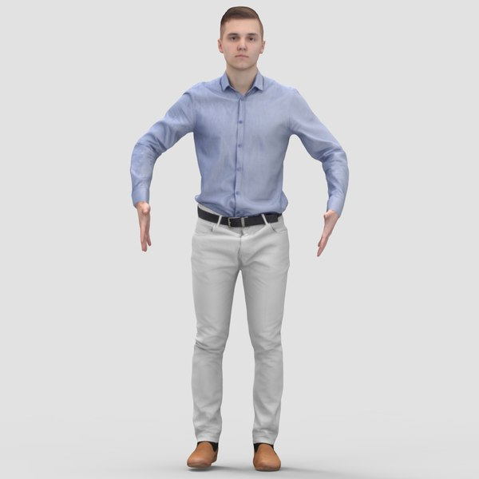

# Body Scan using ML

This is a simple example of a body scan using machine learning. I have used a simple HRNet model to predict the keypoints of the body. The model is trained on the [COCO dataset](https://cocodataset.org/), which is a large dataset of human body keypoints. Once we get the keypoints from the image, we can obtain actual measurements of the body by comparing the pixel distances and upscaling distances with height.

For example:
```python
# Get the shoulder coordinates from the points array
leftShoulder = points[6]
rightShoulder = points[5]

# calculate the distance between the left and right shoulders
shoulderDistance = distance(leftShoulder, rightShoulder)

# upscale the shoulderDistance to the height of the person. This is done by multiplying the distance by the height of the person and dividing by pixel height
shoulderDistance = shoulderDistance * height / pixelHeight
```

# Getting Started
1. Clone this repository
```bash
$ git clone https://github.com/dwij2212/body-scan-django.git
```

2. Install the dependencies
I prefer to use a conda environment and install all dependencies within that environment. A conda environment makes it easier to setup GPU support using PyTorch. You can also do the same using Pip and Virtualenv.

```bash
# Setup conda environment
$ conda create -n body-scan-env python=3.7
$ conda activate body-scan-env

# Install dependencies from requirements.txt
$ conda install --file requirements.txt
```

3. Make migrations and migrate Django database
```bash
$ python manage.py makemigrations
$ python manage.py migrate
```

4. Download the pretrained weights
Download the pretrained weights from this [Google Drive link](https://drive.google.com/file/d/1zYC7go9EV0XaSlSBjMaiyE_4TcHc_S38/view) and place it in the root directory.

Alternatively, if you have gdown installed:
```bash
$ gdown https://drive.google.com/uc?id=1zYC7go9EV0XaSlSBjMaiyE_4TcHc_S38
```

5. Run the server
```bash
$ python manage.py runserver
```

# Output and Trial Input
1. Landing page


2. Results page


3. Input image


4. Marked keypoints on image
